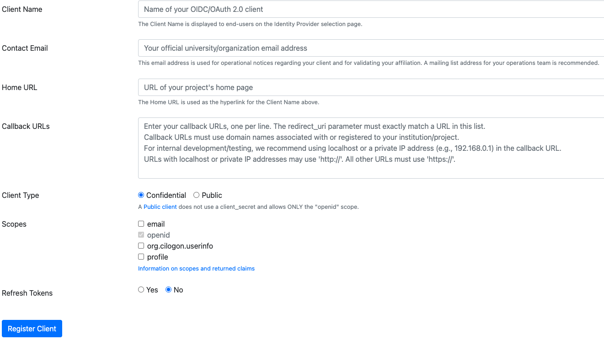

# Creating a New Hub

A hub is one institution's JupyterHub. Every hub runs on the shared `spring-2025`
cluster, mounts home directories from the one in-cluster NFS server, and deploys
through the same pipeline as every other hub. What makes a hub its own thing is a
config directory, a pair of namespaces, a hostname, and its authentication.

Almost all of the work is one script, `create_deployment.sh`. The rest of this
page is what to decide before you run it, and what to do after.

## Prerequisites

### Software Packages

Working installs of:

- [cookiecutter](https://pypi.org/project/cookiecutter/)
- [gcloud](https://cloud.google.com/sdk/docs/install)
- [gh](https://cli.github.com/)
- [hubploy](https://github.com/berkeley-dsep-infra/hubploy)
- [kubectl](https://kubernetes.io/docs/tasks/tools/)
- [sops](https://github.com/getsops/sops/releases)

`pip install -r dev-requirements.txt` from the root of `cal-icor-hubs` gets you
the Python ones.

For `sops`, `gcloud`, `gh` and `kubectl`, follow the links and install appropriately.

Only needed if the hub is going on a new cluster or node pool:

- [opentofu](https://opentofu.org)
- [terragrunt](https://terragrunt.com/)

Installation instructions for these are in the
[cal-icor-hubs README](https://github.com/cal-icor/cal-icor-hubs#installing-other-software-packages-required-to-deploy-infrastructure).

### Authenticating to GCP and GitHub

See the [Administrator Authentication](admin_auth) page for details on how to
log in to all of the systems required to deploy a new hub.

## The canonical list of steps to create a new hub

1. [Name the hub](#name-the-hub).
2. [Decide what it runs on](#decide-what-it-runs-on). Most hubs need nothing here.
3. If it needs its own image, [create that first](new_image).
4. [Register the OAuth application](#authentication) for prod.
5. [Write the deployment config](#the-deployment-config) in `_deploy_configs/<name>.yaml`.
6. From the repo root, on `staging`: `./create_deployment.sh -g <github-user> <name>`
7. [Review and merge](#review-and-merge) the PR the script opens. Merging deploys staging.
8. [Test the staging hub](#test-staging).
9. [Open a PR from `staging` to `prod`](#deploy-to-prod) and merge it.
10. [Create the alerts](#create-the-alerts-for-the-new-hub): `./create_alerts.sh <name>`

## Name the hub

Usually the institution, sometimes the institution plus a course or department.
Lowercase letters, numbers and hyphens, no spaces. It becomes the hostname
(`<name>.jupyter.cal-icor.org`), the namespaces (`<name>-staging`, `<name>-prod`),
the NFS directory and the GitHub label, so it is permanent in practice. Confirm it
with the institution before you run anything.

## Decide what it runs on

The defaults cover most hubs: the shared `user-pool`, the shared NFS server, and
the `base-user-image`. If all three suit, skip to [authentication](#authentication).

Storage is no longer a per-hub decision. Every hub's home directories live on one
XFS disk behind the in-cluster NFS server, and users get a per-user quota rather
than a per-hub allocation. See [user storage](user_storage) for a detailed
overview.

Talk to the institution about class size, assignment frequency and what software
the course needs. That conversation decides two things: whether the hub needs its
own node pool, and whether it needs its own image.

### A dedicated node pool

Worth it for a course large enough to need a different machine type, or one whose
usage you want billed separately. Add a Terragrunt unit under
`tofu/clusters/spring-2025/`; see [cluster infrastructure](infrastructure) for how
the units and labels work.

A new pool also needs a placeholder entry so the pool keeps a warm node. Add it
under `node-placeholder-scaler.nodePools` in `support/values.yaml`:

``` yaml
node-placeholder-scaler:
  nodePools:
    <short-name>:
      nodeSelector:
        hub.jupyter.org/pool-name: <pool-name>
      resources:
        requests:
          # Slightly lower than allocatable RAM on the pool's node type
          memory: 60929654784
      replicas: 1
```

The placeholder has to be big enough that a single user pod evicts it, and small
enough to still fit on a node running the system pods.

Do the math by hand, or let
[determine_placeholder_pod_memory.py](https://github.com/berkeley-dsep-infra/jupyterhub-k8s-node-placeholder/blob/main/tools/determine_placeholder_pod_memory.py)
work out the `memory:` value from a running node.

``` bash
git clone git@github.com:berkeley-dsep-infra/jupyterhub-k8s-node-placeholder.git
cd jupyterhub-k8s-node-placeholder/tools
./determine_placeholder_pod_memory.py <user node name>
```

The short name you choose is what a calendar event refers to when it overrides the
replica count. See the [placeholder scaler](calendar_scaler).

### A dedicated image

Follow [creating a new image](new_image). Do that first: the hub's config needs
somewhere to point.

## Authentication

Staging and prod authenticate differently, and you only register an application
for prod.

Staging uses `DummyAuthenticator` with a shared password. The template ships that
secret already encrypted and copies it verbatim, so there is nothing to create and
nothing to fill in. Staging exists to prove the deployment works, not the identity
provider.

### CILogon

[CILogon](https://www.cilogon.org/faq) handles almost every institution, covering
Shibboleth, InCommon, Microsoft and Google identity providers. Occasionally an
institution's IT department blocks CILogon from returning identity through
Microsoft or Google, and then you fall back to GitHub.

Register one application at
[cilogon.org/oauth2/register](https://cilogon.org/oauth2/register):



Using CSU Long Beach as the example:

- Client Application: California State University, Long Beach
- Contact Email: <cal-icor-staff@lists.berkeley.edu>
- Home Url: `https://<hubname>.jupyter.cal-icor.org`
- Callback URLs: `https://<hubname>.jupyter.cal-icor.org/hub/oauth_callback`
- Client Type: Confidential
- Scopes: email, openid, org.cilogon.userinfo
- Refresh Tokens: No

Registering redirects you to a page with the Client ID and Secret. Copy both
somewhere safe immediately; they go into `_deploy_configs/<name>.yaml` and the
page does not come back.

### GitHub OAuth

- New OAuth App at
  [the cal-icor org settings](https://github.com/organizations/cal-icor/settings/applications)
- Application Name: `<hubname>-auth`
- Homepage URL: `https://<hubname>.jupyter.cal-icor.org`
- Application Description: This manages authentication for `<hubname>`
- Authorization callback URL: `https://<hubname>.jupyter.cal-icor.org/hub/oauth_callback`
- Leave Enable Device Flow unchecked

Copy the Client ID and Secret into the deployment config the same way.

## The deployment config

Copy the example and fill it in:

``` bash
cp _deploy_configs/institution-example.yaml _deploy_configs/<name>.yaml
```

This file is the script's input and nothing else. Nothing deploys from it.

| Key | Notes |
|---|---|
| `hub_name` | The name you picked. Must be DNS-valid |
| `hub_type` | `python-base` (default) or `rstudio-base` |
| `image_name`, `image_tag` | Leave blank for the base user image |
| `hub_nfs_mount_path` | Leave blank to use `hub_name`. Set it to share another hub's home directories |
| `hub_nfs_server_ip` | The NFS service ClusterIP. Leave the default unless it has changed |
| `institution`, `institution_url`, `institution_logo_url` | Rendered into the hub's landing page |
| `landing_page_branch` | `main` unless this hub needs a different landing page |
| `prod.client`, `prod.secret` | From the OAuth application above |
| `admin_emails` | YAML list, appended to the standing infrastructure admins |
| `authenticator_class` | `cilogon` or `github` |
| `authenticator_class_instance` | `CILogonOAuthenticator` or `GitHubOAuthenticator` |
| `idp_url` | CILogon only. Empty string for GitHub |
| `idp_allowed_domains` | CILogon with Microsoft or Google. A YAML list, otherwise an empty string |
| `allow_all` | CILogon with Shibboleth or InCommon. `true`, otherwise an empty string |
| `allowed_organizations` | GitHub only. A YAML list, otherwise an empty string |

Keep every key, even the ones you leave empty. Only `image_name` and `image_tag`
are safe to delete outright.

The script validates the config before it does anything with side effects, and
reports every problem at once:

``` bash
Error: _deploy_configs/<name>.yaml is not ready to deploy:
  - 'institution' is empty
  - 'admin_emails' has a blank list entry
  - 'prod.client' is empty
```

Note that `_deploy_configs/*.yaml` is gitignored apart from the example, so your
filled-in config stays local and never lands in a PR. The OAuth secret in it stays
out of GitHub.

The node pool is not in this file. It comes from the cookiecutter defaults, which
point at the shared user pool. To put the hub somewhere else, either pass `-m` and
change `pool_name` when prompted, or edit the `nodeSelector` in
`deployments/<name>/config/common.yaml` afterwards.

## Run the script

From the root of `cal-icor-hubs`, on the `staging` branch:

``` bash
./create_deployment.sh -g <github-user> <name>
```

It refuses to run from anywhere but the repo root, and refuses to run from any
branch but `staging`.

In order, the script:

1. Cuts a branch, `add-<name>-deployment`.
2. Execs into the `nfs-server` pod and creates `/export/<mount-path>/{staging,prod}`
   and a `_shared` directory in each, owned by uid/gid 1000.
3. Runs the cookiecutter template into `deployments/<name>/`.
4. Encrypts the prod secret with SOPS and deletes the plaintext. The staging secret
   is pre-encrypted.
5. Adds `/export/<name>/staging` and `/export/<name>/prod` to the quota paths in
   `jupyterhub-home-nfs/values.yaml`, re-sorting the list. It skips this when the
   hub shares another hub's mount path.
6. Inserts `hub: <name>` into `.github/labeler.yml` in alphabetical order and
   creates the repo label with `gh`.
7. Commits, pushes the branch, and opens a PR against `staging` carrying that
   label.

Useful flags:

| Flag | Effect |
|---|---|
| `-g`, `--github_user` | Your GitHub username. Required, used to build the PR head ref |
| `-D`, `--dry-run` | Generates `deployments/<name>/` and stops there. No branch, no NFS directories, no label, no push, no PR |
| `-n`, `--no-pr` | Do everything including the push, but stop short of opening the PR |
| `-m`, `--manual-config` | Prompt for every cookiecutter value instead of taking them from the config |
| `-d`, `--deploy` | Run `hubploy` against staging directly after opening the PR |

Start with `-D`. It leaves the generated `deployments/<name>/` in your working tree
to read before anything reaches GitHub, and touches nothing else: no branch, no NFS
directories, no label, no push. It still encrypts the prod secret and deletes the
plaintext, both inside that directory.

Clean up before the real run. Cookiecutter refuses to write over an existing output
directory, so a leftover dry run stops the next attempt (yes, annoying, and the
script will learn to clean up after itself 'soon'):

``` bash
git clean -fd deployments/<name>
```

## Review and merge

Read the generated files before merging, particularly `config/prod.yaml`, where
the authenticator block varies most by institution.

The PR carries `hub: <name>`, which is the label that deploys this one hub. It
also touches `jupyterhub-home-nfs/values.yaml`, which picks up
`jupyterhub-home-nfs-deployment`, so merging redeploys the NFS chart to apply the
new quota paths. Both are correct here. Leave them on.

Merging to `staging` deploys the hub to `<name>-staging`. See
[the deployment pipeline](deploy_pipeline) for what runs and how to read the gate.

## Test staging

The staging hub is at `https://<name>-staging.jupyter.cal-icor.org` and takes any
username with the dummy password:

``` bash
sops -d deployments/<name>/secrets/staging.yaml
```

Log in, start a server, confirm the image is the one you expected and that the
home directory persists across a restart.

## Deploy to prod

Open a PR from `staging` to `prod`
(<https://github.com/cal-icor/cal-icor-hubs/compare/prod...staging>) and merge it.
Only the hub layer runs on a merge to `prod`.

HTTPS takes a few minutes while cert-manager issues the certificate. After that
the hub is at `https://<name>.jupyter.cal-icor.org`, behind the real
authenticator. Log in as yourself to confirm the identity provider works, which is
the part staging could not tell you.

## Create the alerts for the new hub

Uptime checks are not created by the pipeline. Once prod is up, from the repo root:

``` bash
./create_alerts.sh <name>
```

That creates the uptime check and alert policy for `<name>-prod` and enables them.
See [monitoring and alerting](monitoring_alerting).

## The single-user server image

The image is set in `deployments/<name>/config/common.yaml`:

``` yaml
jupyterhub:
  singleuser:
    image:
      name: us-central1-docker.pkg.dev/cal-icor-hubs/user-images/base-user-image
      tag: <hash>
```

A hub inheriting an existing image gets a real tag from the cookiecutter template
and needs nothing further.

A hub with its own image gets the tag `PLACEHOLDER`, filled in after the fact by
the image repo's build workflow.

:::{admonition} Merge order matters for a new image
:class: warning
The `cal-icor-hubs` PR has to merge before the new image configuration is pushed
to `main` in the image repo. The image build workflow updates the tag in
`deployments/<name>/config/common.yaml`, so that file has to exist first.
:::

## Update the `cloudbank-pilot-hub-users` repo with generated auth tokens

The [`cloudbank-pilot-hub-users`](https://github.com/cal-icor/cloudbank-pilot-hub-users)
repo runs a nightly dashboard job that queries each Cal-ICOR hub's
`/hub/api/users` endpoint to report the number of users per hub for reporting
purposes. Under JupyterHub 5.x, an API token can't list users unless it's
explicitly granted the scopes to do so, so each hub defines a read-only service account, `cloudbank-pilot-hub-users`, for this purpose.

The dashboard only ever queries **production** hubs, so this service account
only needs to exist in each hub's `prod` config/secrets — it is not set up for `staging`.

### The role stanza

Each hub's `deployments/<hub>/config/prod.yaml` defines a `loadRoles` entry
granting the `cloudbank-pilot-hub-users` service `list:users` and `read:users` scopes:

``` yaml
jupyterhub:
  hub:
    loadRoles:
      cloudbank-pilot-hub-users:
        services:
          - cloudbank-pilot-hub-users
        scopes:
          - list:users
          - read:users
```

If a hub's `prod.yaml` doesn't define this role and stanza, its `prod` config
should be updated to include one when the service account is added or its
tokens rotated.

### The per-hub token

Each hub also defines a **unique** SOPS-encrypted API token for the service,
in `deployments/<hub>/secrets/prod.yaml`:

``` yaml
jupyterhub:
  hub:
    services:
      cloudbank-pilot-hub-users:
        apiToken: <unique per-hub token>
```

### Generating and setting a token

This is automatically generated when deploying a new hub with
`create_deployment.sh`. If you need to generate one manually, please run the
following command and update that deployment's `secrets/prod.yaml`.

``` bash
openssl rand -hex 32
```

### Keeping it in sync with cloudbank-pilot-hub-users

The dashboard authenticates using these same tokens, so whenever a hub's token
is created here, the **same value** must also be updated in the
[`cloudbank-pilot-hub-users`](https://github.com/sean-morris/cloudbank-pilot-hub-users)
repo's `enc-pilots.json`, in the `token` field of the pilot entry matching this
hub (matched by `url`, where `where: icor`).

You can get the generated token to put in `enc-pilots.json` by running:

``` bash
sops -d --extract '["jupyterhub"]["hub"]["services"]["cloudbank-pilot-hub-users"]["apiToken"]' \
  deployments/<hub>/secrets/prod.yaml
```

`sops` prints the token without a trailing newline, so zsh appends a `%` to the
line. It is not part of the token.

If the two repos' tokens drift, the dashboard will get a `403` /
`Missing or invalid credentials` error querying that hub until they're
brought back in sync.
